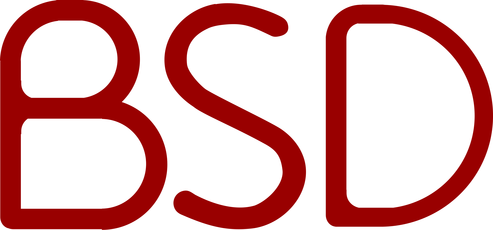

<h2><em><strong>IT student at </em></strong></h2>

  
  

    <h3 align="left"><em><strong>Practice:</em></strong></h3>
    <h4><strong>System programming:</strong></h4>
    <ul>
      <li>Multiprocessing | Multithreading (POSIX)</li>
      <li>Shell implementation (Bash mirror)</li>
    </ul>
    <h4><strong>Graphic programming:</strong></h4>
    <ul>
      <li>2D Game | Wireframe | Fractal</li>
      <li>Rendering pipeline</li>
      <li>Raycasting | Raytracing</li>
    </ul>
    <h4><strong>Network programming:</strong></h4>
    <ul>
      <li>Web-Server | IRC implementation (UNIX socket)</li>
    </ul>
    <h4><strong>System administration:</strong></h4>
    <ul>
      <li>Linux distribution setup</li>
      <li>Docker deployment</li>
    </ul>
    <h4><strong>Full-stack programming:</strong></h4>
    <ul>
      <li>Full dynamic website implementation</li>
    </ul>
    <h2></h2>
  

  

    <h3><em><strong>Language</strong></em></h3>
    &nbsp;&nbsp;
    
    &nbsp;
    
    &nbsp;
    
    &nbsp;
    
    &nbsp;
    
    &nbsp;
    
    &nbsp;
    
    &nbsp;
    
  

  <picture>
    <source media="(prefers-color-scheme: dark)" srcset="https://github-readme-stats.vercel.app/api/top-langs?username=algadea&locale=en&hide_title=true&layout=compact&card_width=320&langs_count=12&theme=vision-friendly-dark&hide_border=true&order=2" height="110" alt="languages graph">
    <source media="(prefers-color-scheme: light)" srcset="https://github-readme-stats.vercel.app/api/top-langs?username=algadea&locale=en&hide_title=true&layout=compact&card_width=320&langs_count=12&theme=graywhite&hide_border=false&order=2" height="110" alt="languages graph">
    
  </picture>
  

    <h3><em><strong>Platform</strong></em></h3>
    &nbsp;&nbsp;
    
    &nbsp;
    
    &nbsp;
    
    &nbsp;
    
    &nbsp;
    
  

  

    <h3><em><strong>Distribution</strong></em></h3>
    &nbsp;&nbsp;
    
    &nbsp;
    
    &nbsp;
    
    &nbsp;
    
    &nbsp;
    
  

<picture>
  <source media="(prefers-color-scheme: dark)" srcset="https://github-readme-stats.vercel.app/api?username=algadea&hide_title=true&hide_rank=true&show_icons=true&include_all_commits=true&count_private=true&disable_animations=true&theme=vision-friendly-dark&locale=en&hide_border=true&order=1" height="165" alt="stats graph">
  <source media="(prefers-color-scheme: light)" srcset="https://github-readme-stats.vercel.app/api?username=algadea&hide_title=true&hide_rank=true&show_icons=true&include_all_commits=true&count_private=true&disable_animations=true&theme=graywhite&locale=en&hide_border=false&order=1" height="165" alt="stats graph">
  
</picture>
  

    <h3><em><strong>Editor</em></strong></h3>
    &nbsp;&nbsp;
    
    &nbsp;
    
    &nbsp;
    
    &nbsp;
    
  

  

    <h3><em><strong>Workflow</strong></em></h3>
    &nbsp;&nbsp;
    
    &nbsp;
    
    &nbsp;
    
    &nbsp;
    
  

 

  <picture>
    <source media="(prefers-color-scheme: dark)" srcset="https://github-readme-activity-graph.vercel.app/graph?username=algadea&radius=16&theme=modern-lilac&area=true&order=5&hide_title=true&hide_border=true&bg_color=000000" height="300" alt="activity-graph graph">
    <source media="(prefers-color-scheme: light)" srcset="https://github-readme-activity-graph.vercel.app/graph?username=algadea&radius=16&theme=high-contrast&area=true&order=5&hide_title=true&hide_border=true" height="300" alt="activity-graph graph">
    
  </picture>

<h2></h2>
<h3 align="center"><strong>Contact</strong></h3>

    
    &nbsp;
    
    &nbsp;
    

