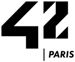

<h2><em><strong>Software engineering student at </em></strong></h2>

  
  

    <h3 align="left"><em><strong>Practice:</em></strong></h3>
    <h4><strong>System programming:</strong></h4>
    <ul>
      <li>Multiprocessing | Multithreading (POSIX)</li>
      <li>Shell implementation (Bash mirror)</li>
    </ul>
    <h4><strong>Graphic programming:</strong></h4>
    <ul>
      <li>2D Game | Wireframe | Fractal</li>
      <li>Rendering pipeline</li>
      <li>Raycasting | Raytracing</li>
    </ul>
    <h4><strong>Network programming:</strong></h4>
    <ul>
      <li>Web-Server | IRC implementation (UNIX socket)</li>
    </ul>
    <h4><strong>System administration:</strong></h4>
    <ul>
      <li>Linux distribution setup</li>
      <li>Docker deployment</li>
    </ul>
    <h4><strong>Full-stack programming:</strong></h4>
    <ul>
      <li>Full dynamic website implementation</li>
    </ul>
    <h2></h2>
  

  

    <h3><em><strong>Language</strong></em></h3>
    &nbsp;&nbsp;
    
    &nbsp;
    
    &nbsp;
    
    &nbsp;
    
    &nbsp;
    
    &nbsp;
    
    &nbsp;
    
  

  

    <h3><em><strong>Platform</strong></em></h3>
    &nbsp;&nbsp;
    
    &nbsp;
    
    &nbsp;
    
    &nbsp;
    
  

  

    <h3><em><strong>Distro</strong></em></h3>
    &nbsp;&nbsp;
    
    &nbsp;
    
    &nbsp;
    
    &nbsp;
    
  

  

    <h3><em><strong>Editor</em></strong></h3>
    &nbsp;&nbsp;
    
    &nbsp;
    
    &nbsp;
    
    &nbsp;
    
  

  

    <h3><em><strong>Workflow</strong></em></h3>
    &nbsp;&nbsp;
    
    &nbsp;
    
    &nbsp;
    
  

<h2></h2>
<h3 align="center"><strong>Contact</strong></h3>

    
    &nbsp;
    
    &nbsp;
    
    &nbsp;
    

