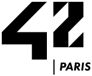

<h2><em><strong>IT student at </em></strong></h2>

  
  

    <h3 align="left"><em><strong>Practice:</em></strong></h3>
    <h4><strong>System programming:</strong></h4>
    <ul>
      <li>Multiprocessing | Multithreading (POSIX)</li>
      <li>Mini-shell (Bash mirror)</li>
    </ul>
    <h4><strong>Graphic programming:</strong></h4>
    <ul>
      <li>2D Game | Wireframe | Fractal</li>
      <li>Raycasting | Raytracing</li>
    </ul>
    <h4><strong>Network programming:</strong></h4>
    <ul>
      <li>Web-server | IRC chat</li>
    </ul>
    <h4><strong>System administration:</strong></h4>
    <ul>
      <li>Linux distribution setup</li>
      <li>Docker deployment</li>
    </ul>
    <h4><strong>Full-stack programming:</strong></h4>
    <ul>
      <li>Web application (pong)</li>
    </ul>
  

<h2></h2>

   
  

    <table width="100%">
    <td align="center" valign="top">
    <h3><strong>CTF</strong></h3>
    

    <a href="https://www.root-me.org/anska"><strong>root-me.org/anska</strong></a>
     
    <a href="https://tryhackme.com/p/anska"><strong>tryhackme.com/anska</strong></a>
     
    <a href="https://app.hackthebox.com/users/2283278"><strong>hackthebox/anska</strong></a>
     
    <a href="https://www.42ctf.org/en/accounts/profile/anska?"><strong>42ctf.org/anska</strong></a>
     
    </td>
    <td align="center" valign="top">
    <h3><strong>Technology</strong</h3>
    

    <h5><strong>Language</strong></h5>
    &nbsp;
    
    &nbsp;
    
    &nbsp;
    
    &nbsp;
    
    &nbsp;
    
    &nbsp;
    
    <h5><strong>Platform</strong></h5>
    &nbsp;
    
    &nbsp;
    
    &nbsp;
    
    &nbsp;
    
    &nbsp;
    
    &nbsp;
    
    &nbsp;
    
    &nbsp;
    
    <h5><strong>Tools</strong></h5>
    &nbsp;
    
    &nbsp;
    
    &nbsp;
    
    &nbsp;
    
    &nbsp;
    
    &nbsp;
    
    &nbsp;
    
    &nbsp;
    
    </td>
    <td align="center" valign="top">
    <h3><strong>Coding</strong></h3>
    

    <a href="https://leetcode.com/u/anska_/"><strong>leetcode.com/anska</strong></a>
     
    <a href="https://www.codingame.com/profile/6160140ea161f06ea18df960622d480e6694884"><strong>codingame.com/anska</strong></a>
     
    <a href="https://www.codewars.com/users/anska"><strong>codewars.com/anska</strong></a>
     
    </td>
    </table>
  

 
<h2></h2>

  <h3><strong>Contact</strong></h3>
  
  &nbsp;
  
  &nbsp;
  

  <a href="https://anska.dev"><strong>anska.dev</strong></a>

